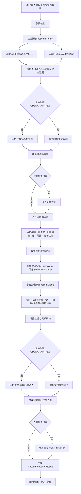

# 学术会议议题与演讲候选人推荐系统项目白皮书

## 1. 项目定位

本项目是一个面向学术会议筹备场景的本地可部署 MVP 系统，目标是把“会议主题策划”和“演讲嘉宾初筛”这两项原本高度依赖人工的工作，沉淀为一条可复用、可解释、可回退的半自动流程。

系统当前提供三项核心能力：

1. 根据会议总主题自动生成分论坛议题。
2. 围绕每个议题检索并推荐候选演讲人。
3. 将结果导出为 PDF 推荐报告。

这不是一个纯大模型生成器，而是一套“公开学术数据检索 + 规则打分 + 可选 LLM 复核”的混合式推荐流程。其设计重点不是追求语言表述华丽，而是尽量保证推荐过程有公开证据支撑、参数边界清晰、回退策略明确。

## 2. 功能范围

### 2.1 用户侧操作流程

系统的前端交互分为三步：

1. 输入会议大主题与议题数量，生成议题。
2. 编辑、确认或单条重生成议题，并设置候选人推荐参数。
3. 生成候选人推荐结果，查看详情并导出 PDF。

### 2.2 支持的关键参数

系统当前通过参数校验保证输入边界可控：

| 参数 | 说明 | 规则 |
| --- | --- | --- |
| `conferenceTheme` | 会议大主题 | 必填 |
| `topicCount` | 议题数量 | 1 到 10 |
| `candidateCountPerTopic` | 每个议题候选人数 | 1 到 5 |
| `scope` | 候选人范围 | `domestic` 国内 / `international` 国际 |
| `preferYoungScholar` | 是否优先青年学者 | 布尔值 |

## 3. 系统运行规则

### 3.1 运行方式

本项目为 Next.js Web 应用，启动方式如下：

```bash
npm install
cp .env.local.example .env.local
npm run dev
```

默认访问地址为 [http://localhost:3000](http://localhost:3000)。

### 3.2 环境变量与能力开关

系统能力会受环境变量影响：

| 环境变量 | 作用 |
| --- | --- |
| `OPENAI_API_KEY` | 启用 LLM 议题生成、议题描述增强、候选人复核 |
| `TOPIC_LLM_MODEL` | 议题生成与增强模型 |
| `CANDIDATE_LLM_MODEL` | 候选人复核模型 |
| `OPENALEX_MAILTO` | 提升 OpenAlex 检索稳定性 |
| `OPENALEX_API_KEY` | 可选 OpenAlex 免费 API key，用于提升高频检索稳定性 |
| `SEMANTIC_SCHOLAR_API_KEY` | 启用 Semantic Scholar 辅助检索 |
| `SCHOLAR_SEARCH_PROVIDER` | 若设为 `hybrid`，启用 OpenAlex + Semantic Scholar 混合检索 |
| `ENABLE_MOCK_FALLBACK` | 检索为空时允许回退到示例数据 |
| `ENABLE_LINK_REACHABILITY_CHECK` | 开启候选人链接可达性校验 |

### 3.3 运行原则

系统遵循以下原则：

1. 优先使用公开学术数据，而不是直接编造内容。
2. 若存在 LLM，仅允许其在结构化约束下生成或复核，不直接决定数据来源真实性。
3. 若外部检索不足，必须显式回退，并向用户展示告警或说明。
4. 输出结果必须保留推荐依据、缺失字段和来源说明，避免伪精确推荐。

## 4. 题目生成机制

### 4.1 总体思路

议题生成不是直接根据用户输入一次性吐出标题，而是分为两层：

1. 先做主题研究，提取关键词、热点方向和论文证据。
2. 再基于这些信号生成议题，并做质量控制与回退。

### 4.2 主题研究阶段

系统首先调用 `researchTopic(theme)`，优先从 OpenAlex 检索近五年论文数据。

其处理规则如下：

1. 针对主题构造最多 3 组查询词。
2. 若主题包含如“人工智能、医学、治理、材料、能源”等模式，会自动补充英文扩展词。
3. 从 OpenAlex `works` 检索近五年论文，按被引次数降序拉取结果。
4. 聚合论文中的 `topics`、`keywords`、`concepts`，形成：
   - `keywords`：综合关键词
   - `hotspotDirections`：热点方向
   - `evidence`：近年论文标题证据

### 4.3 主题研究回退规则

如果 OpenAlex 检索失败或提取不到有效关键词，则进入启发式回退：

1. 直接从用户主题文本中切分中文短语、英文短语和连接词片段。
2. 生成启发式关键词列表。
3. 把 `usedFallback` 标记为 `true`。

这意味着系统明确区分了“学术检索增强生成”和“仅根据主题关键词推断生成”两种质量等级。

### 4.4 LLM 议题生成规则

当配置了 `OPENAI_API_KEY` 时，系统优先走 LLM 议题生成链路，规则包括：

1. 必须生成中文正式分论坛名称。
2. 议题之间要有区分度。
3. 禁止出现“相关专题”“研究进展”“若干思考”等空泛标题。
4. `description` 必须是 25 到 60 字的具体说明。
5. `basis` 必须说明该议题来源于哪些研究热点或论文线索。
6. 输出必须满足 JSON Schema。

生成后还会做二次过滤，以下情况会被判定为低质量并淘汰：

1. 标题过短或像“相关专题 1”这样的占位标题。
2. 描述过短、过空或包含明显弱提示词。
3. `basis` 太短或缺失。
4. 关键词少于 2 个。

### 4.5 规则式议题生成回退

如果没有配置 OpenAI，或者 LLM 未生成出合格结果，则使用算法式生成：

1. 从 `hotspotDirections` 中抽取关键词池。
2. 套用一组预定义的标题模板生成正式议题名称。
3. 自动生成简短说明和生成依据。
4. 对标题做去重，使用标题 Jaccard 相似度阈值 `0.65` 去除重复议题。

如果最后仍不足指定数量，则使用最终兜底议题：

`<主题>相关专题 N`

同时给出“当前公开学术数据不足，建议人工补充具体学科子方向”的说明。

### 4.6 议题增强与重生成

系统支持对弱描述议题做 LLM 增强，增强规则是：

1. 保留原议题核心含义，不大幅改题。
2. 只补写更具体的说明、关键词和生成依据。

单条重生成时，系统会：

1. 重新生成一批候选议题。
2. 排除与已有议题标题完全相同的项。
3. 排除与已有议题标题相似度高于 `0.65` 的项。
4. 若仍找不到新题，则回退到兜底议题。

## 5. 候选人检索与筛选机制

### 5.1 总体思路

候选人推荐不是从全网抓人名，而是围绕每个议题构造检索词，先获得一批公开学术身份，再根据相关性、活跃度与影响力打分，并在可用时由 LLM 做二次复核。

### 5.2 每个议题的检索输入

系统会为每个议题生成一组检索关键词：

1. 基础来源包括议题 `keywords`、议题标题、会议总主题。
2. 若命中“人工智能、自然语言处理、医学影像、治理”等中文模式，会自动扩展为英文学术词。
3. 最终把关键词、标题和主题分词后去重，形成检索词集合。

### 5.3 学者检索来源

系统默认以 OpenAlex 为主。OpenAlex 同时覆盖作者、论文、机构、国家、引用、H-index 与 Topics，适合作为当前 MVP 的人才实体与学术证据主库。

若配置允许混合检索，还可同时接入 Semantic Scholar：

1. OpenAlex：检索相关论文、作者、机构、国家、论文数、被引数、H-index、Topics 等。
2. Semantic Scholar：补充作者主页、单位等辅助信息。

两类数据最终会优先按 OpenAlex 作者 ID 合并；缺少稳定 ID 时，再按“姓名 + 机构”归一化合并，避免同名学者误并。

### 5.4 OpenAlex 检索规则

针对每个议题，系统会：

1. 构造最多 3 个查询变体。
2. 优先搜索近五年相关 `works`，从高相关论文作者中建立候选池。
3. 再搜索 `authors`，补充论文数、被引数、H-index、机构与作者主页等画像字段。
4. 根据 `scope` 限定地区：
   - `domestic` 只保留 `CN`
   - `international` 排除 `CN`

### 5.5 候选人画像补全

对于 OpenAlex 作者，系统会补抓近五年论文标题，用于：

1. 输出详细说明。
2. 判断其是否在该方向持续活跃。
3. 支撑推荐理由中的“近期研究证据”。

### 5.6 青年学者识别规则

系统当前把以下任一条件满足者视为“青年学者候选”：

1. `hIndex <= 25`
2. `worksCount <= 100`

这不是年龄判断，而是基于公开学术产出规模的简化代理变量。

## 6. 候选人评分规则

### 6.1 评分公式

每位候选人的综合分采用 100 分制，并保留评分拆解：

```text
总分 = 主题贴合度 + 近期活跃度 + 学术影响力 + 数据可信度 + 青年优先加分 + LLM 复核调整
```

具体规则如下：

1. 主题贴合度：上限 40 分，综合议题关键词、OpenAlex Topics、近期相关论文标题与主题命中。
2. 近期活跃度：上限 20 分，依据近五年相关论文数量与发表新近程度。
3. 学术影响力：上限 20 分，使用被引数、H-index 与近期相关论文引用做对数/上限归一化。
4. 数据可信度：上限 10 分，依据机构、国家、数据库链接、主页/ORCID、主题与近期作品完整度。
5. 青年优先加分：若 `preferYoungScholar = true` 且命中青年规则，最多加 5 分。
6. LLM 复核调整：若启用 LLM，可在 `-5` 到 `+5` 之间做主观相关性调整。

最终结果四舍五入为整数。

### 6.2 关键词匹配规则

`matchedKeywords` 来自议题关键词集合与学者 OpenAlex Topics、概念标签、近五年相关论文标题之间的匹配，最多保留 5 个。

这决定了系统把“研究主题直接匹配”放在最重要的位置，而不是单纯按学术头衔或被引排序。

### 6.3 推荐理由生成规则

候选人的推荐理由由规则拼装，优先包含：

1. 与议题直接匹配的关键词。
2. 近五年持续研究证据。
3. H-index 与被引次数。
4. 是否满足青年优先条件。

如果可解释字段不足，则输出“已检索到相关公开学术记录，但可用于解释的字段有限”。

## 7. 候选人筛选规则

### 7.1 候选池过滤

候选人进入正式候选池前，需要满足“有证据可解释”的最低要求：

1. 必须有 `databaseUrl`。
2. 且至少满足以下之一：
   - 有匹配关键词
   - 有研究方向字段
   - 有近期论文摘要信息
   - 有成果摘要信息

不满足以上条件的候选人不会进入最终排序池。

### 7.2 链接校验规则

系统会先校验主页链接与数据库链接是否为合法 `http/https` 地址。

如果打开了 `ENABLE_LINK_REACHABILITY_CHECK=true`，还会进一步进行 HEAD/GET 可达性验证；验证失败的链接会被移除，而不是保留坏链。

### 7.3 LLM 复核规则

如果配置了 OpenAI，系统会对每个议题取评分前 12 名候选人交给 LLM 复核。

LLM 的职责不是找新的人，而是在现有候选池中做主观相关性复核、说明优化和小幅分数调整，且受到明确约束：

1. 只能从提供的候选人中选择，禁止编造人物。
2. 优先判断是否与议题“直接贴合”。
3. 泛相关候选人不能优先入选。
4. 必须输出 `fitVerdict` 与 `adjustment`，其中 `adjustment` 会被服务端限制在 `-5` 到 `+5`。
5. 在相关性相近时，才允许适度偏向青年学者。

LLM 输出后，系统只采用其复核说明、关键词修正和小幅调整分，不会替换真实身份信息，也不能新增候选人。

### 7.4 最终入选规则

每个议题的最终入选遵循以下优先级：

1. 先取通过 LLM 复核且未被其他议题占用的候选人。
2. 若数量不足，再从规则打分池中补足，要求：
   - 未被其他议题占用
   - 有数据库链接
   - 至少有 1 个匹配关键词
3. 若仍不足，则允许从当前池中重复入选，但会标注：
   - `候选池有限，因议题高度相关而重复入选。`
4. 若最终仍不足指定人数，系统会生成警告。

### 7.5 跨议题去重规则

系统默认跨议题去重，同一候选人的身份键为：

```text
name.toLowerCase() + "::" + institution
```

这意味着系统优先追求“不同议题尽量对应不同候选人”，只有在候选池不足时才允许重复。

## 8. 输出结果结构

系统最终输出 `RecommendationResult`，其中包含：

1. 会议主题
2. 生成时间
3. 议题列表
4. 每个议题对应的候选人列表
5. 候选人范围
6. 是否开启青年优先
7. 告警信息
8. 数据来源说明

每位候选人会附带：

1. 综合评分
2. 推荐理由
3. 研究方向
4. 近期研究摘要
5. 成果摘要
6. 来源标签
7. 数据完整度
8. 缺失字段
9. 评分拆解与证据摘要
10. LLM 复核说明
11. 学者主页与学术数据库链接

数据完整度规则如下：

1. 缺失字段不超过 1 项：`high`
2. 缺失字段 2 到 3 项：`medium`
3. 缺失字段 4 项及以上：`low`

## 9. 结果解释与边界

### 9.1 当前系统的强项

1. 有明确参数边界和回退路径。
2. 题目生成有学术证据输入，不完全依赖语言模型臆造。
3. 候选人推荐强调主题直接相关性，而不是只看头衔。
4. 输出可解释，能看到推荐理由、缺失字段和来源。

### 9.2 当前系统的边界

1. 青年学者识别仍是启发式规则，不等同于真实年龄或职称判定。
2. 跨库合并主要按姓名归一，存在同名学者误合并风险。
3. 国际/国内筛选依赖机构国家码，若源数据缺失可能影响范围判断。
4. 若外部数据源稀疏，结果会退化为“基于有限公开证据的推荐”。
5. 若未配置 OpenAI，系统不会进行候选人 LLM 复核，只保留规则打分排序。

## 10. 核心逻辑图



## 11. 结论

从实现逻辑看，本项目的本质不是“自动替代会务判断”，而是“为学术会议组委会提供一套带证据、带规则、可回退的初筛引擎”。

它尤其适合以下场景：

1. 新办论坛或专题分会场的议题起草。
2. 需要快速形成候选专家池的会务准备阶段。
3. 需要先出一版结构化草案，再交由学术委员会人工复核的工作流。

如果后续要继续产品化，最值得增强的方向会是：

1. 更准确的人物去重与身份核验。
2. 更细粒度的学科分类与多语言检索。
3. 引入组织偏好、邀请难度、历史合作关系等会务侧约束。
4. 对“候选人为何入选/为何未入选”提供更细的审计说明。
